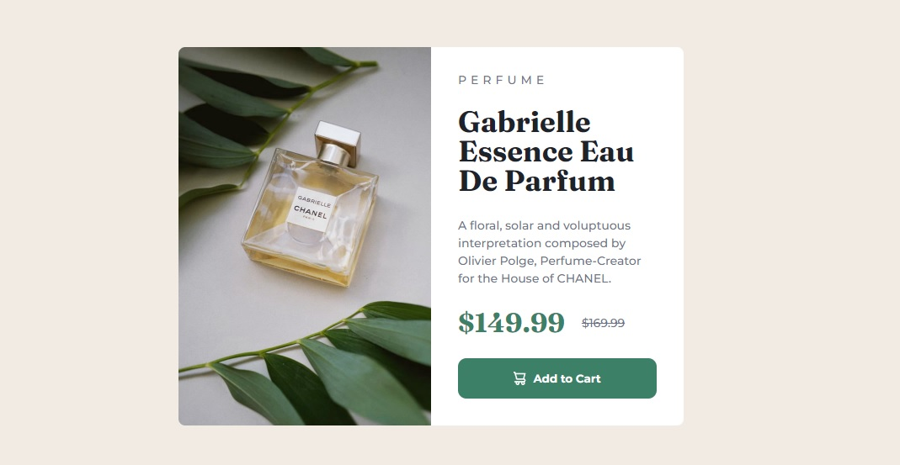
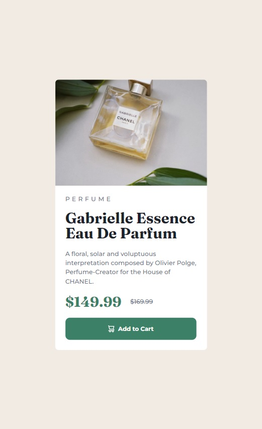

# Frontend Mentor - Product preview card component solution

This is a solution to the [Product preview card component challenge on Frontend Mentor](https://www.frontendmentor.io/challenges/product-preview-card-component-GO7UmttRfa).

## Overview

 

 
This frontendmentor challenge was a lot harder than the first one, but it was really fun to do.
 
 
I had a little trouble switching images between the desktop and mobile versions, but I think I found a valid solution.

## Screenshot

### Desktop Version

### Mobile Version

### Links

- [Solution in Front End Mentor Site:]()
- [Live Site](https://vitormagnago.github.io/product-preview-card-component/)

## My process

I started creating the page already having in mind to use flexbox for practically everything, I know that some things could be solved with inline-block and adjusting margins and padding, but I need to train more the positioning of elements by flexbox.

I used Photoshop a lot to confirm dimensions and pixel count. I defined the size (width x height) of several elements, perhaps I wouldn't have needed to do it that way, but this gave me more confidence, with time I improve more in relation to this topic.

### What I learned

This time I correctly used the media queries to create the mobile version, but I had a lot of difficulty changing the images according to the version.

It took me a long time to find a solution, a lot of research and mistakes to find an acceptable way to accomplish this.

The solution I found was to create two tags, one for each image and then use media queries to "hide" the image from the other layout with `display: none`.

Using this mode, I believe the browser renders both photos, which is not good for performance and optimization. I would like to know a more efficient way to accomplish this.

## Author

- Frontend Mentor - [@VitorMagnago](https://www.frontendmentor.io/profile/VitorMagnago)
